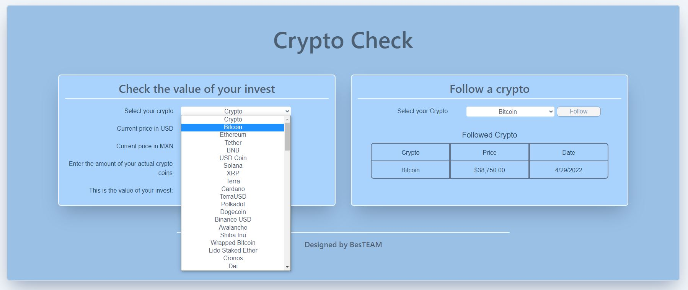

# Team-Proyect-1

How we decided to develop this project:
* Each of the team members came with a project proposal, after some discussions and conversations about each of the poposal we decided by the most viable according to our current web development knowledge.

* Once an idea was selected, each of the teammembers created a draft of the project idea or desging before starting to code.

* Then we proceed to create High level user stories as a guide for code.

* The feature that we have developed is related with Cryptocurencies, these are the user stories we want to resolve as part of this project.

* Here is an example of the MVP proposal designs 

* Heres is an image in case we are able to complete the MVP on time 

# High Level User Stories used to start development

* As a user and owner of cryptocurrencies, I want a feature that allow me to have the realtime price of the TOP 100 cryptocurrecnies.

* As a user of the feature I want to be able to select the cryptocurrency of my choice and get the real time price.

* As a user of the feature I want to be able to input the number of tokens I own from the selected cryptocurrency and get the total investment using the real time price.

* As a user I want the feature to store the total investment amount of the first crytocurrency selected and be able to select as many cryptocurrencies as the user wishes.

* As a user after selecting all the cryptocurrencies I want to be able get an estimate of the total investment from all the cryptocurrencies selected with the owned tokens.

* "Nice to have" - As a user I want the feature to create a graph with a pie chart that shows the total number of cryptocurrency tokens owned and show the % that each token represent in my total investment.

* As a user I want another feature that sends me an email notification of the Crypto token of my choice, the parameters to send the email will be determined by the Above price determined by the user and the under price determined by the user, so that I am able to know when to buy or sell the token of my interest.

# Design user stories

* As a user, I want a feature that is responsive in any portable device.

* As a user, I want a one single page that shows all the information related with my cryptocurrency portfolio.

* As a user, I want the feature to be in blue color.

* Some images of the final UI 

# Technical User Stories

* As a user, I want the feature to consume https://www.coingecko.com/ API, therefore to get all the information relates with the TOP 100 crytocurrencies.

* As a user, I want the feature to store cryptocurrency values using local storage

* Images of Cryptocurrency information pulled from coingecko API 

* Selected Crypto token 

* Investment amount shown 

## How Project Requirements were covered 

* Use a CSS framework other than Bootstrap./ We used tailwind

* Be deployed to GitHub Pages. / this is the Repository URL of the project https://github.com/AngelMond/Proyect-1

* Be interactive (i.e., accept and respond to user input). / covered in the following images
* Images of Cryptocurrency information pulled from coingecko API 

* Selected Crypto token 

* Investment amount shown 

* Use at least two [server-side APIs](https://coding-boot-camp.github.io/full-stack/apis/api-resources). / we used https://www.coingecko.com/en/api

* Does not use alerts, confirms, or prompts (use modals).

* Use client-side storage to store persistent data.

* Be responsive. / Reference to the following images.

* Have a polished UI.

* Have a clean repository that meets quality coding standards (file structure, naming conventions, follows best practices for class/id naming conventions, indentation, quality comments, etc.).

* Have a quality README (with unique name, description, technologies used, screenshot, and link to deployed application).
